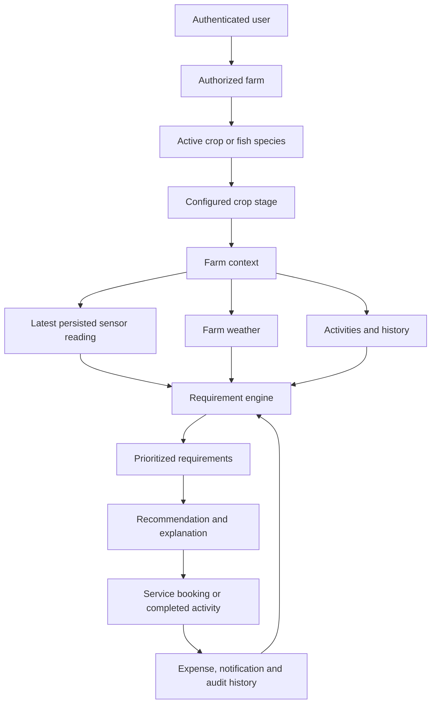

# AI Farm Brain — Complete Project Guide

This guide explains the technology choices, architecture, development workflow, source layout, local operation, deployment path, and recommended future roadmap.

## Technology stack

| Layer | Technology | Purpose |
|---|---|---|
| Web application | Next.js 15 App Router | Responsive pages and server-side REST API in one deployable application |
| User interface | React 19, TypeScript, custom responsive CSS, Lucide icons | Farmer, provider, worker and administrator experiences |
| Backend API | Next.js route handlers | Authentication, farms, requirements, sensors, weather, bookings and AI endpoints |
| Validation | Zod | Validates every external request before database writes |
| Database | PostgreSQL 17 | Durable relational storage and farm-level data isolation |
| ORM | Prisma 6 | Type-safe queries, relational constraints, migrations and demo seeding |
| Authentication | bcryptjs, JOSE JWT, HTTP-only cookies | Password hashing and seven-day secure sessions |
| Registration | Email/password with immediate session creation | Lets every farmer create an account without an OTP step |
| Farm intelligence | Configurable deterministic rule engine | Safe crop-stage and sensor-based requirement generation |
| Sensors | Provider abstraction and persisted demo simulator | Realistic demo data now; replaceable by IoT ingestion later |
| Weather | Provider abstraction with deterministic fallback | Farm-location weather context without breaking demos when APIs fail |
| Testing | Vitest plus authenticated HTTP smoke workflow | Rules, sensors, fishery behavior, isolation and service lifecycle verification |
| Deployment | Vercel configuration plus managed PostgreSQL | Same-origin frontend and API deployment |

## Core architecture



The system never begins from a generic product or service list. It begins with an authorized `farmId`, loads that farm's active crop and stage, evaluates only matching database rules, and links any resulting booking back to the same farm/crop pair.

## Security and isolation design

Farm access is checked by `requireFarm()` on the server. Farmer-provided IDs are never trusted by themselves.

The database also has a composite foreign key between `(farmCropId, farmId)` and the owning `FarmCrop`. This means even a direct database operation cannot pair a cotton crop from one farm with a paddy requirement belonging to another farm.

Other protections include:

- Bcrypt password hashing with cost factor 12
- Rate-limited registration and login requests
- Secure, HTTP-only, same-site session cookies
- Role checks for farmer, provider, worker and administrator endpoints
- Valid booking state transitions
- Zod input validation and human-readable API errors
- Security response headers and audit logging
- No pesticide or fertilizer dosage invention

## Important source files

```text
ai farm hub/
├── app/
│   ├── api/[...path]/route.ts       Complete authenticated REST API
│   ├── auth/                        Register and login
│   ├── farms/                       Farm list, creation and workspace routes
│   ├── dashboard/                   Farmer overview
│   ├── services/                    Agricultural marketplace
│   ├── bookings/                    Booking execution history
│   ├── ai-assistant/                Selected-farm assistant
│   ├── provider/dashboard/          Provider operations
│   ├── worker/dashboard/            Worker profile
│   ├── admin/dashboard/             Platform monitoring
│   ├── globals.css                  Complete responsive visual system
│   └── page.tsx                     Public landing page
├── components/
│   ├── AppShell.tsx                 Navigation and persistent farm switcher
│   ├── DashboardClient.tsx          Multi-farm dashboard
│   ├── NewFarmForm.tsx              Agriculture/fishery onboarding
│   ├── FarmWorkspace.tsx            Requirements, sensors and farm operations
│   ├── MarketplaceClient.tsx        Service discovery
│   ├── BookingsClient.tsx           Booking lifecycle UI
│   ├── AiAssistantClient.tsx        Farm-specific chat interface
│   └── PortalClient.tsx             Provider, worker and admin portals
├── lib/
│   ├── auth.ts                      Sessions, roles and farm authorization
│   ├── requirements.ts              Farm Brain requirement pipeline
│   ├── sensors.ts                   Sensor provider abstraction and simulator
│   ├── weather.ts                   Weather provider abstraction
│   ├── validation.ts                Request schemas
│   ├── db.ts                        Prisma database client
│   └── api.ts                       Consistent API responses and errors
├── prisma/
│   ├── schema.prisma                Relational domain model
│   ├── migrations/                  Versioned production SQL migrations
│   └── seed.ts                      Crops, rules, services and demo accounts
├── tests/farm-brain.test.ts         Integration and isolation tests
├── .env.example                     Environment variable template
├── vercel.json                      Vercel deployment configuration
└── README.md                        Setup and deployment instructions
```

## Main API groups

| Group | Examples |
|---|---|
| Authentication | `POST /api/auth/register`, `/login`, `/logout` |
| Farms | `GET/POST /api/farms`, `GET /api/farms/{id}/dashboard` |
| Requirements | `GET /api/farms/{id}/requirements`, `POST .../generate` |
| Sensors | `GET /api/farms/{id}/sensors`, `POST .../demo-sensors/simulate` |
| Weather | `GET /api/farms/{id}/weather`, `POST .../refresh` |
| Work and money | Farm activities, expenses and analytics endpoints |
| Marketplace | `GET /api/services`, `POST /api/bookings`, booking status updates |
| Farm AI | `POST /api/ai/farm-analysis`, `POST /api/ai/chat` |
| Operations | Provider, worker, admin and notification endpoints |

## Demo accounts

All seeded accounts use password `Demo@123`.

| Role | Email |
|---|---|
| Farmer | `farmer@demo.com` |
| Provider | `provider@demo.com` |
| Worker | `worker@demo.com` |
| Admin | `admin@demo.com` |

The farmer starts with three isolated workspaces:

- Syam Paddy Farm — three acres, paddy, tillering
- Syam Cotton Farm — two acres, cotton, flowering
- Tilapia Fish Pond — one acre, tilapia, grow-out

## Develop locally

```powershell
npm install
npx prisma migrate deploy
npm run db:seed
npm run dev
```

Then open `http://localhost:3000`.

After schema changes:

```powershell
npx prisma migrate dev --name describe_your_change
npm test
npm run build
```

## Production deployment

The public deployment needs two resources:

1. A Vercel project for this Next.js application.
2. Persistent PostgreSQL from Supabase, Neon, Railway or another provider.

Set the variables from `.env.example` in Vercel. For Supabase on Vercel, use the transaction pooler (port `6543`) as `DATABASE_URL`; use the direct connection or session pooler (port `5432`) as `DIRECT_URL` for migrations. Run `npx prisma migrate deploy` against the cloud database, optionally seed the hackathon demo, and deploy the application. Never copy the local `.env` or the workspace PostgreSQL URL into production.

## Recommended next development phases

### Phase 1 — Pilot readiness

- Add Telugu translations with route-level language selection
- Add password reset and account recovery
- Replace in-memory rate limiting with Redis/Upstash
- Add provider onboarding, identity documents and admin approval
- Add worker job offers and worker booking assignments
- Add file uploads for crop photographs and invoices

### Phase 2 — Better agronomy

- Have local agronomists review crop-stage rules for each target district
- Add soil-test report entry and laboratory result imports
- Add configurable economic pest thresholds
- Add crop calendar and automatic stage progression
- Add explainable yield estimates with confidence ranges
- Keep pesticide and fertilizer recommendations behind professional verification

### Phase 3 — Real integrations

- Implement a production weather provider using farm coordinates
- Add MQTT/HTTP IoT device ingestion and signed device credentials
- Add SMS and WhatsApp notification providers
- Add payment authorization, invoices, refunds and provider payouts
- Add maps, distance calculations and provider dispatch tracking

### Phase 4 — Operations and scale

- Move asynchronous notifications and analyses into a job queue
- Add observability, error monitoring and business event analytics
- Add database backups, recovery exercises and data-retention policies
- Add offline-first mobile support and low-bandwidth synchronization
- Conduct an independent security review before storing real farmer data

## Verification already completed

- TypeScript validation passed
- Five PostgreSQL integration/security tests passed
- Production Next.js build passed
- Authenticated paddy booking workflow passed through completion and re-analysis
- Cotton and fishery context switching passed
- Cross-user farm access returned `404`
- Wrong-password authentication returned `401`
- Deliberate cross-farm database write was rejected by PostgreSQL
