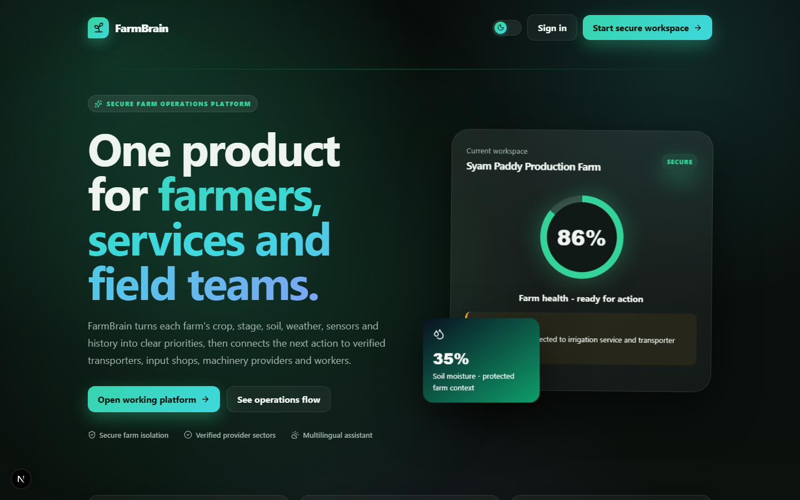
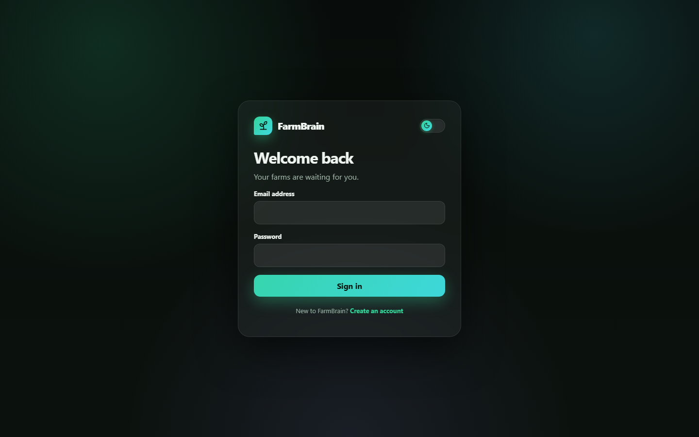
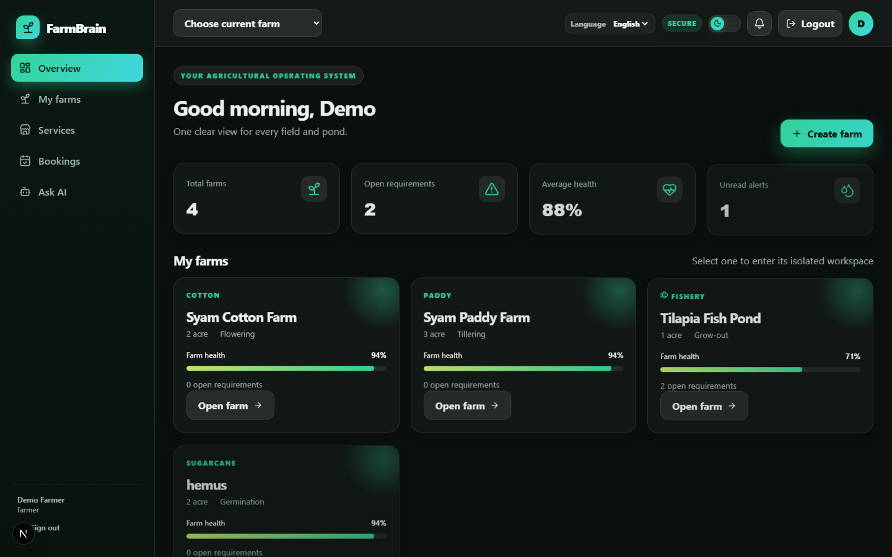
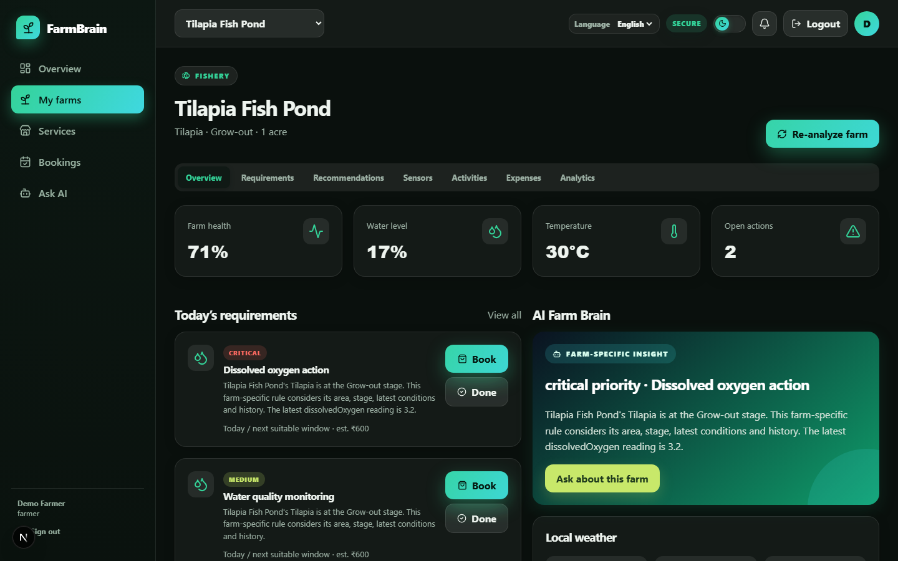
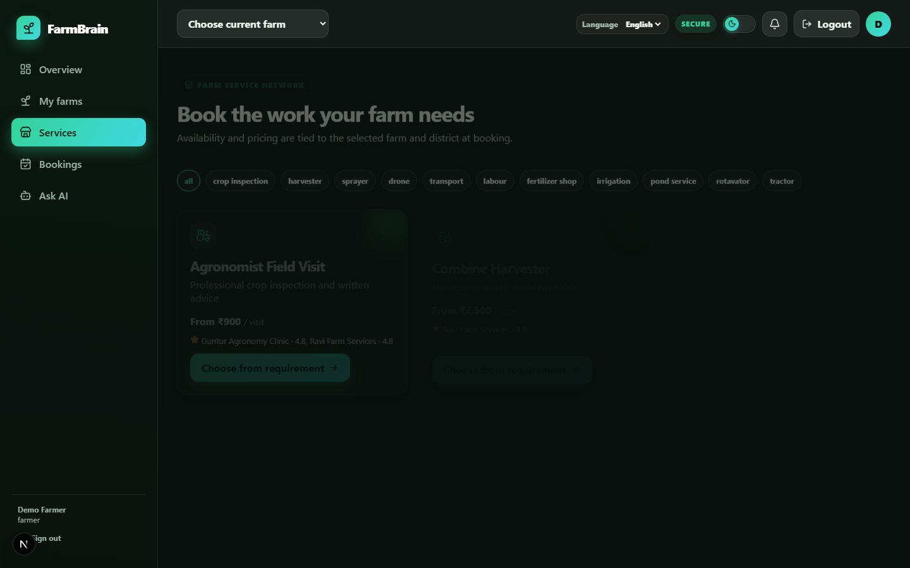
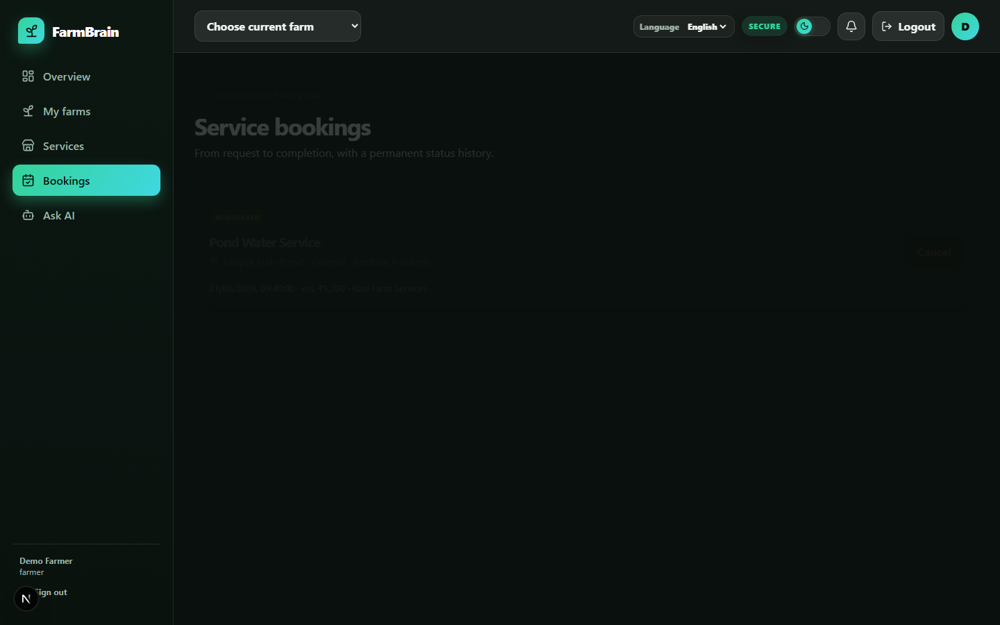
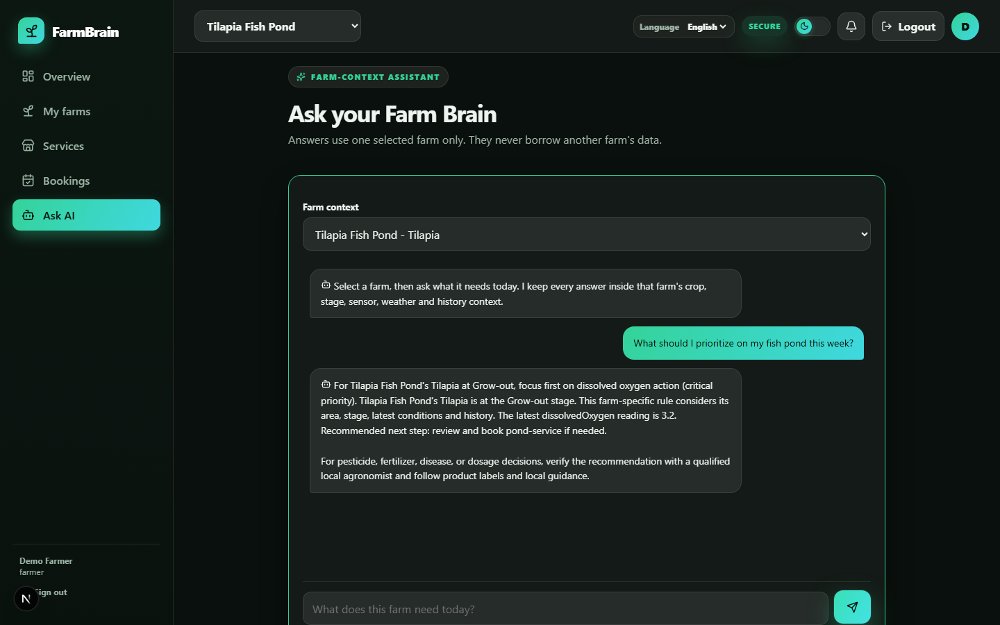
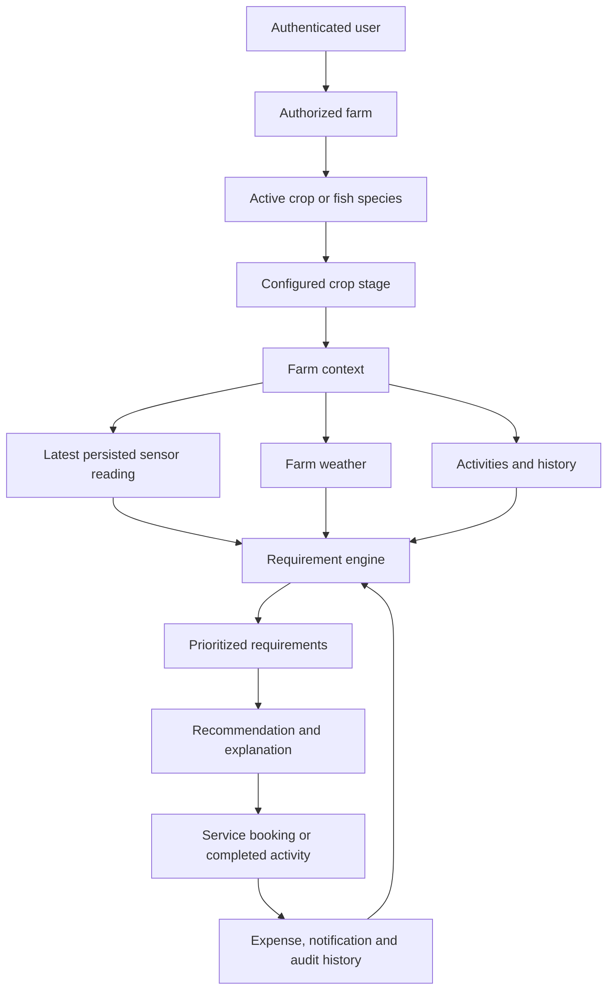

<div align="center">

# 🌾 AI Farm Brain

**A full-stack agricultural operating platform for farmers, service providers, workers and administrators.**

Every sensor reading, requirement, recommendation, booking, activity, expense and AI interaction is isolated to a specific farm and its active crop or fish species.

[](https://nextjs.org/)
[](https://react.dev/)
[](https://www.typescriptlang.org/)
[](https://www.postgresql.org/)
[](https://www.prisma.io/)
[](https://vitest.dev/)
[](https://vercel.com/)

[Overview](#overview) • [Screenshots](#screenshots) • [Features](#key-features) • [Architecture](#architecture) • [Getting started](#getting-started) • [API](#api-overview) • [Security](#security--data-isolation) • [Roadmap](#roadmap)

</div>

---

## Overview

**AI Farm Brain** (FarmBrain) turns each farm's crop, growth stage, soil, weather, sensor readings and activity history into clear, prioritized action items — then connects the recommended next action directly to a verified service provider, transporter, input shop or field worker.

The system never starts from a generic product catalog. It starts with an authorized `farmId`, resolves that farm's active crop and stage, evaluates only the database rules that match, and links any resulting booking, expense or notification back to the same farm/crop pair — so a paddy farm's data can never leak into a cotton farm's or a fish pond's view.

## Screenshots

<table>
<tr>
<td width="50%">

**Landing page**


</td>
<td width="50%">

**Secure sign-in**


</td>
</tr>
<tr>
<td width="50%">

**Multi-farm dashboard**


</td>
<td width="50%">

**Farm workspace & requirement engine**


</td>
</tr>
<tr>
<td width="50%">

**Provider marketplace**


</td>
<td width="50%">

**Service bookings & history**


</td>
</tr>
<tr>
<td colspan="2">

**Farm-scoped AI assistant**


</td>
</tr>
</table>

## Key features

- 🔐 Open email/password registration with an immediate secure session
- 🍪 Secure HTTP-only JWT sessions and role-based access for farmers, providers, workers and admins
- 🌱 Multiple agriculture farms and fish ponds with configurable crop/species, variety and stage catalogs
- 🧠 A database-driven requirement engine using farm area, crop stage, latest sensors, weather and recent completed work
- 📡 Persisted demo sensor scenarios that pass through the same provider abstraction intended for physical IoT devices
- ⛅ Farm-location weather abstraction with a deterministic demo fallback
- 📋 Prioritized requirements with reason, timing, cost estimate, safety advice and matching services
- 🛒 Provider marketplace, farm/crop/requirement-linked bookings, validated status transitions and completion history
- 💸 Activities, automatic expenses, notifications, health history, analytics and farm-specific AI memory/chat
- 👥 Farmer, provider, worker and admin experiences, responsive down to mobile screens
- 🛡️ PostgreSQL constraints that prevent a farm record from being paired with another farm's crop

## Architecture



Farm access is checked by `requireFarm()` on the server for every request — farmer-provided IDs are never trusted by themselves. The database also enforces a composite foreign key between `(farmCropId, farmId)` and the owning `FarmCrop`, so even a direct database write cannot pair a cotton crop from one farm with a paddy requirement belonging to another.

## Tech stack

| Layer | Technology | Purpose |
|---|---|---|
| Web application | Next.js 15 (App Router) | Responsive pages and a server-side REST API in one deployable application |
| User interface | React 19, TypeScript, custom responsive CSS, Lucide icons | Farmer, provider, worker and administrator experiences |
| Backend API | Next.js route handlers | Authentication, farms, requirements, sensors, weather, bookings and AI endpoints |
| Validation | Zod | Validates every external request before database writes |
| Database | PostgreSQL 17 | Durable relational storage and farm-level data isolation |
| ORM | Prisma 6 | Type-safe queries, relational constraints, migrations and demo seeding |
| Authentication | bcryptjs, JOSE JWT, HTTP-only cookies | Password hashing and seven-day secure sessions |
| Farm intelligence | Configurable deterministic rule engine | Safe crop-stage and sensor-based requirement generation |
| Sensors | Provider abstraction + persisted demo simulator | Realistic demo data now; replaceable by IoT ingestion later |
| Weather | Provider abstraction with deterministic fallback | Farm-location weather context without breaking demos when APIs fail |
| Testing | Vitest + authenticated HTTP smoke workflow | Rules, sensors, fishery behavior, isolation and service lifecycle verification |
| Deployment | Vercel configuration + managed PostgreSQL | Same-origin frontend and API deployment |

## Getting started

### Prerequisites

- Node.js 20+
- PostgreSQL 15+

### Local setup

```bash
git clone https://github.com/syamdumpala/ai-farm-brain.git
cd ai-farm-brain

# Copy the environment template and fill in DATABASE_URL / JWT_SECRET
cp .env.example .env

npm install
npx prisma migrate deploy
npm run db:seed
npm run dev
```

Open [http://localhost:3000](http://localhost:3000) and sign in with the seeded demo farmer account:

```text
farmer@demo.com
Demo@123
```

Provider, worker and admin demo accounts use `provider@demo.com`, `worker@demo.com`, and `admin@demo.com` with the same password.

### Demo accounts

| Role | Email | Password |
|---|---|---|
| Farmer | `farmer@demo.com` | `Demo@123` |
| Provider | `provider@demo.com` | `Demo@123` |
| Worker | `worker@demo.com` | `Demo@123` |
| Admin | `admin@demo.com` | `Demo@123` |

The seeded farmer starts with isolated workspaces including a paddy farm, a cotton farm and a tilapia fish pond — each with its own crop stage, sensors, requirements and history.

## Project structure

```text
ai-farm-brain/
├── app/
│   ├── api/[...path]/route.ts       Complete authenticated REST API
│   ├── auth/                        Register and login
│   ├── farms/                       Farm list, creation and workspace routes
│   ├── dashboard/                   Farmer overview
│   ├── services/                    Agricultural marketplace
│   ├── bookings/                    Booking execution history
│   ├── ai-assistant/                Selected-farm assistant
│   ├── provider/dashboard/          Provider operations
│   ├── worker/dashboard/            Worker profile
│   ├── admin/dashboard/             Platform monitoring
│   ├── globals.css                  Complete responsive visual system
│   └── page.tsx                     Public landing page
├── components/                      AppShell, dashboards, workspace, marketplace, chat, portals
├── lib/
│   ├── auth.ts                      Sessions, roles and farm authorization
│   ├── requirements.ts              Farm Brain requirement pipeline
│   ├── sensors.ts                   Sensor provider abstraction and simulator
│   ├── weather.ts                   Weather provider abstraction
│   ├── validation.ts                Request schemas
│   ├── db.ts                        Prisma database client
│   └── api.ts                       Consistent API responses and errors
├── prisma/
│   ├── schema.prisma                Relational domain model
│   ├── migrations/                  Versioned production SQL migrations
│   └── seed.ts                      Crops, rules, services and demo accounts
├── tests/farm-brain.test.ts         Integration and isolation tests
├── docs/screenshots/                README screenshots
├── .env.example                     Environment variable template
└── vercel.json                      Vercel deployment configuration
```

See [PROJECT_GUIDE.md](./PROJECT_GUIDE.md) for the complete technology, architecture and development walkthrough.

## API overview

| Group | Examples |
|---|---|
| Authentication | `POST /api/auth/register`, `/login`, `/logout` |
| Farms | `GET/POST /api/farms`, `GET /api/farms/{id}/dashboard` |
| Requirements | `GET /api/farms/{id}/requirements`, `POST .../generate` |
| Sensors | `GET /api/farms/{id}/sensors`, `POST .../demo-sensors/simulate` |
| Weather | `GET /api/farms/{id}/weather`, `POST .../refresh` |
| Work and money | Farm activities, expenses and analytics endpoints |
| Marketplace | `GET /api/services`, `POST /api/bookings`, booking status updates |
| Farm AI | `POST /api/ai/farm-analysis`, `POST /api/ai/chat` |
| Operations | Provider, worker, admin and notification endpoints |

## Required production variables

Use [.env.example](./.env.example) as the source of truth. At minimum configure PostgreSQL, a 32+ character `JWT_SECRET`, and `APP_URL`. Weather and AI keys are optional because safe deterministic providers remain available.

## Deploy to Vercel + managed PostgreSQL

1. Create a PostgreSQL database on Neon, Supabase, Railway or another provider and copy its pooled connection string.
2. Import this repository in Vercel and add all production environment variables.
3. Run `npx prisma migrate deploy` against the production database from CI or a trusted terminal.
4. Optionally run `npm run db:seed` for a demo. Do not seed demo accounts for a real farmer pilot.
5. Deploy. The frontend and REST API are one same-origin Next.js application, so no permissive cross-origin configuration is required.

For a split frontend/backend deployment later, allow only the exact frontend origin and keep cookie credentials enabled; never use wildcard CORS with authenticated routes.

## Security & data isolation

- Bcrypt password hashing with cost factor 12
- Rate-limited registration and login requests
- Secure, HTTP-only, same-site session cookies
- Server-side role checks for farmer, provider, worker and administrator endpoints
- Validated booking state transitions
- Zod input validation and human-readable API errors
- Security response headers and audit logging
- Composite foreign-key constraints that make cross-farm data pairing impossible at the database level
- No pesticide or fertilizer dosage invention — see [Safe recommendation boundary](#safe-recommendation-boundary)

## Testing

```bash
npm test
npm run build
```

The test suite exercises configurable thresholds, persisted sensor behavior, paddy/cotton/fishery separation, critical pond risk, and database-level farm/crop isolation.

## Safe recommendation boundary

The deterministic engine can prioritize monitoring and operational services. It intentionally does **not** invent pesticide or fertilizer dosages. Any crop-protection, fertilizer, disease or dosage decision must be confirmed against product labels, local agricultural guidance and a qualified local agronomist.

## Roadmap

<details>
<summary><strong>Phase 1 — Pilot readiness</strong></summary>

- Add Telugu translations with route-level language selection
- Add password reset and account recovery
- Replace in-memory rate limiting with Redis/Upstash
- Add provider onboarding, identity documents and admin approval
- Add worker job offers and worker booking assignments
- Add file uploads for crop photographs and invoices

</details>

<details>
<summary><strong>Phase 2 — Better agronomy</strong></summary>

- Local agronomist review of crop-stage rules for each target district
- Soil-test report entry and laboratory result imports
- Configurable economic pest thresholds
- Crop calendar and automatic stage progression
- Explainable yield estimates with confidence ranges
- Pesticide and fertilizer recommendations kept behind professional verification

</details>

<details>
<summary><strong>Phase 3 — Real integrations</strong></summary>

- Production weather provider using farm coordinates
- MQTT/HTTP IoT device ingestion and signed device credentials
- SMS and WhatsApp notification providers
- Payment authorization, invoices, refunds and provider payouts
- Maps, distance calculations and provider dispatch tracking

</details>

<details>
<summary><strong>Phase 4 — Operations and scale</strong></summary>

- Move asynchronous notifications and analyses into a job queue
- Observability, error monitoring and business event analytics
- Database backups, recovery exercises and data-retention policies
- Offline-first mobile support and low-bandwidth synchronization
- Independent security review before storing real farmer data

</details>

## Contributing

Issues and pull requests are welcome. Please open an issue describing the change before submitting a large pull request.

---

<div align="center">

Built for farmers, agri-service providers and field teams.

</div>
